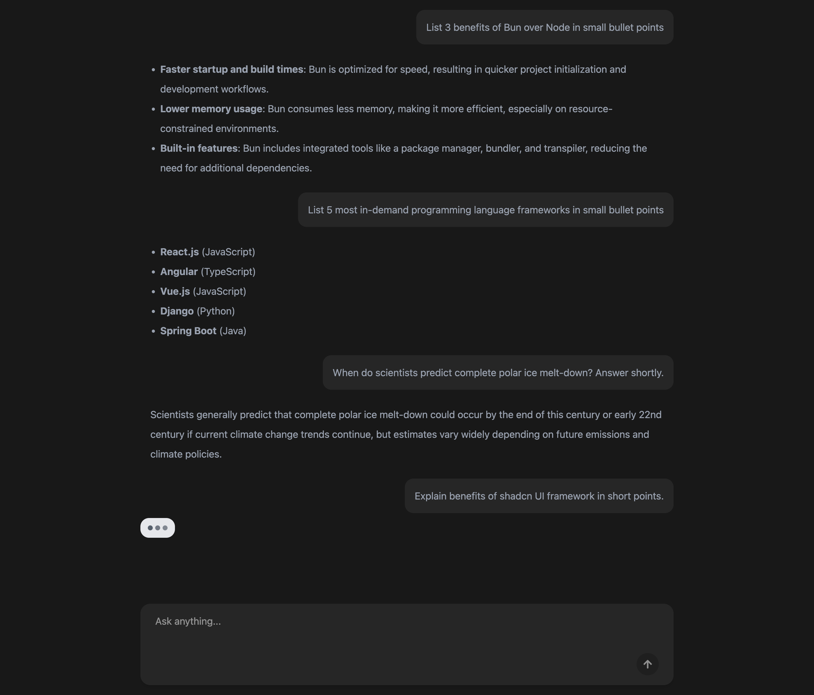

# LLM Chatbot FullStack App



## Overview

This project is a full-stack chatbot application powered by a large language model (LLM). It consists of a client-side interface built with React, TypeScript, Tailwind CSS, ShadCN UI and Vite, and a server-side API developed using Bun, Express Js & Typescript. The chatbot enables users to interact with an LLM for conversational tasks.

## Features

- **Client**: A responsive React-based UI for user interaction.
- **Server**: Handles API requests and integrates with the LLM.
- **Real-time Communication**: Typing indicators and message updates.

## Installation

To install dependencies for the entire project:

```bash
bun install
```

## Running the Application

To run the full application:

```bash
bun run dev
```

## Environment Variables

The server requires an OpenAI API key to function. Copy the `.env.example` file to `.env` and add your OpenAI API key:

```env
OPENAI_API_KEY=your_openai_api_key_here
```

Ensure the `.env` file is located in the `packages/server` directory.

## License

This project is licensed under the MIT License.
